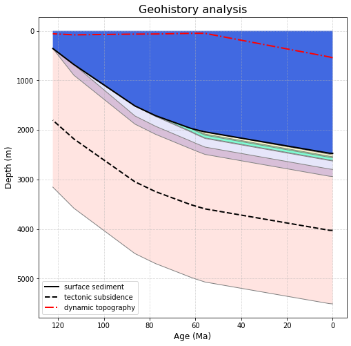

.. _pybacktrack_backstrip:

Backstrip
=========

.. contents::
   :local:
   :depth: 2

.. _pybacktrack_backstrip_overview:

Overview
--------

The ``backstrip`` module is used to find tectonic subsidence from paleo water depths, and sediment decompaction over time.

.. _pybacktrack_running_backstrip:

Running backstrip
-----------------

You can either run ``backstrip`` as a built-in script, specifying parameters as command-line options (``...``):

.. code-block:: python

    python -m pybacktrack.backstrip_cli ...

...or ``import pybacktrack`` into your own script, calling its functions and specifying parameters as function arguments (``...``):

.. code-block:: python

    import pybacktrack
    
    pybacktrack.backstrip_and_write_well(...)

.. note:: You can run ``python -m pybacktrack.backstrip_cli --help`` to see a description of all command-line options available, or
          see the :ref:`backstripping reference section <pybacktrack_reference_backstripping>` for documentation on the function parameters.

.. _pybacktrack_backstrip_example:

Example
^^^^^^^

To backstrip the sunrise drill site (located on shallower *continental* crust), and output all available parameters (via the ``-d`` option), we can run it from the command-line as:

.. code-block:: python

    python -m pybacktrack.backstrip_cli \
        -w pybacktrack_examples/example_data/sunrise_lithology.txt \
        -l primary extended \
        -d age compacted_depth compacted_thickness decompacted_thickness decompacted_density decompacted_sediment_rate decompacted_depth min_tectonic_subsidence max_tectonic_subsidence average_tectonic_subsidence min_water_depth max_water_depth average_water_depth sea_level paleo_longitude paleo_latitude lithology \
        -slm Haq87_SealevelCurve_Longterm \
        -o sunrise_backstrip_amended.txt \
        -- \
        sunrise_backstrip_decompacted.txt

...or write some Python code to do the same thing:

.. code-block:: python

    import pybacktrack
    
    # Input and output filenames.
    input_well_filename = 'pybacktrack_examples/example_data/sunrise_lithology.txt'
    amended_well_output_filename = 'sunrise_backstrip_amended.txt'
    decompacted_output_filename = 'sunrise_backstrip_decompacted.txt'
    
    # Read input well file, and write amended well and decompacted results to output files.
    pybacktrack.backstrip_and_write_well(
        decompacted_output_filename,
        input_well_filename,
        lithology_filenames=[pybacktrack.PRIMARY_BUNDLE_LITHOLOGY_FILENAME,
                             pybacktrack.EXTENDED_BUNDLE_LITHOLOGY_FILENAME],
        sea_level_model=pybacktrack.BUNDLE_SEA_LEVEL_MODELS['Haq87_SealevelCurve_Longterm'],
        decompacted_columns=[pybacktrack.BACKSTRIP_COLUMN_AGE,
                             pybacktrack.BACKSTRIP_COLUMN_COMPACTED_DEPTH,
                             pybacktrack.BACKSTRIP_COLUMN_COMPACTED_THICKNESS,
                             pybacktrack.BACKSTRIP_COLUMN_DECOMPACTED_THICKNESS,
                             pybacktrack.BACKSTRIP_COLUMN_DECOMPACTED_DENSITY,
                             pybacktrack.BACKSTRIP_COLUMN_DECOMPACTED_SEDIMENT_RATE,
                             pybacktrack.BACKSTRIP_COLUMN_DECOMPACTED_DEPTH,
                             pybacktrack.BACKSTRIP_COLUMN_MIN_TECTONIC_SUBSIDENCE,
                             pybacktrack.BACKSTRIP_COLUMN_MAX_TECTONIC_SUBSIDENCE,
                             pybacktrack.BACKSTRIP_COLUMN_AVERAGE_TECTONIC_SUBSIDENCE,
                             pybacktrack.BACKSTRIP_COLUMN_MIN_WATER_DEPTH,
                             pybacktrack.BACKSTRIP_COLUMN_MAX_WATER_DEPTH,
                             pybacktrack.BACKSTRIP_COLUMN_AVERAGE_WATER_DEPTH,
                             pybacktrack.BACKSTRIP_COLUMN_SEA_LEVEL,
                             pybacktrack.BACKSTRIP_COLUMN_PALEO_LONGITUDE,
                             pybacktrack.BACKSTRIP_COLUMN_PALEO_LATITUDE,
                             pybacktrack.BACKSTRIP_COLUMN_LITHOLOGY],
        # Might be an extra stratigraphic well layer added from well bottom to basement...
        ammended_well_output_filename=amended_well_output_filename)

.. note:: The drill site file ``pybacktrack_examples/example_data/sunrise_lithology.txt`` is part of the :ref:`example data <pybacktrack_install_examples>`.

.. _pybacktrack_backstrip_output:

Backstrip output
----------------

For each stratigraphic layer in the input drill site file, ``backstrip`` can write one or more parameters to an output file.

Running the :ref:`above example <pybacktrack_backstrip_example>` on the sunrise drill site:

.. include:: ../pybacktrack/example_data/sunrise_lithology.txt
   :literal:

...produces an :ref:`amended drill site output file <pybacktrack_backstrip_output_amended_drill_site>`,
and a :ref:`decompacted output file <pybacktrack_backstrip_output_decompacted>` containing the decompacted output parameters like
sediment thickness and tectonic subsidence.

.. _pybacktrack_backstrip_output_amended_drill_site:

Amended drill site output
^^^^^^^^^^^^^^^^^^^^^^^^^

The amended drill site output file:

.. Note we're using 'test_data' instead of 'example_data' since only the former directory contains output files.
.. include:: ../tests/test_data/sunrise_backstrip_amended.txt
   :literal:

.. note:: No extra :ref:`base sediment layer <pybacktrack_base_sediment_layer>` is added from the bottom of the
          drill site (2311 metres) to the total sediment thickness at the drill site (1298.15 metres),
          because the former (bottom of drill site) is already deeper than the latter (total sediment thickness).
          This happens because the :ref:`default total sediment thickness grid <pybacktrack_bundled_total_sediment_thickness_grid>` is not
          as accurate near continental margins (compared to deeper ocean basins).

.. _pybacktrack_backstrip_output_decompacted:

Decompacted output
^^^^^^^^^^^^^^^^^^

The decompacted output file:

.. Note we're using 'test_data' instead of 'example_data' since only the former directory contains output files.
.. include:: ../tests/test_data/sunrise_backstrip_decompacted.txt
   :literal:

The *age*, *compacted_depth*, *min_water_depth*, *max_water_depth* and *lithology* columns are the same as the *bottom_age*, *bottom_depth*,
*min_water_depth*, *max_water_depth* and *lithology* columns in the input drill site (except there is also a row associated with the surface age).

The *compacted_thickness* column is the bottom depth of the drill site (2311 metres - noting that there is no base sediment layer in the
:ref:`amended drill site <pybacktrack_backstrip_output_amended_drill_site>` above) minus *compacted_depth*.
The *decompacted_thickness* column is the thickness of all sediment at the associated age. In other words, at each consecutive age
another stratigraphic layer is essentially removed, allowing the underlying layers to expand (due to their porosity). At present day
(or the surface age) the decompacted thickness is just the compacted thickness. And note that because no extra
:ref:`base sediment layer <pybacktrack_base_sediment_layer>` was added to the bottom of the drill site (2311 metres) the thickness and density is zero there.
The *decompacted_density* column is the average density integrated over the decompacted thickness of the drill site (each stratigraphic layer contains
a mixture of water and sediment according to its porosity at the decompacted depth of the layer). The *decompacted_sediment_rate* column is the rate of
sediment deposition in units of metres/Ma. At each time it is calculated as the fully decompacted thickness (ie, using surface porosity only) of the
surface stratigraphic layer (whose deposition ends at the specified time) divided by the layer's deposition time interval. The *decompacted_depth* column is
similar to *decompacted_sediment_rate* in that the stratigraphic layers are fully decompacted (using surface porosity only) as if no portion of any layer had
ever been buried. It is also similar to *compacted_depth* except all effects of compaction have been removed.

The *average_water_depth* column is just the average *min_water_depth* and *max_water_depth*. And *min_tectonic_subsidence*, *max_tectonic_subsidence* and
*average_tectonic_subsidence* are obtained from *min_water_depth* and *max_water_depth* and *average_water_depth* by adding an isostatic correction of the
decompacted sediment thickness (to obtain the deeper isostatically compensated, sediment-free water depth also known as tectonic subsidence).

Finally, the *paleo_longitude* and *paleo_latitude* columns contain the :ref:`paleo location of the drill site <pybacktrack_backstrip_paleo_locations>` at each *age*.

.. note:: The output columns are specified using the ``-d`` command-line option (run ``python -m pybacktrack.backstrip_cli --help`` to see all options), or
          using the *decompacted_columns* argument of the :func:`pybacktrack.backstrip_and_write_well` function.
          By default, only *age* and *decompacted_thickness* are output.

By default, the rows are associated with the stratigraphic ages in the input drill site.
However, you can specify your own time for each row using the ``-tl`` or ``-tr`` command-line options (run ``python -m pybacktrack.backstrip_cli --help`` for more details)
or using the *times* argument of the :func:`pybacktrack.backstrip_and_write_well` function.
And it's OK to specify times that are *outside* the period of sediment deposition recorded in the drill site
(eg, older than the drill site's bottom age or younger than its surface age). You will still get rows for these times.

.. note:: Specifying your own times (eg, using ``-tl`` or ``-tr`` command-line options) means that a time could fall *inside* a stratigraphic unit
          (ie, not exactly on a stratigraphic boundary, as in the default case).
          In this case, a sub-section of the *surface* stratigraphic unit (that's at the surface at the specified time) is stripped off to create a
          :meth:`partial unit <pybacktrack.StratigraphicUnit.create_partial_unit>`.
          The part that's stripped off is from the unit's top age to the specified time (assuming a constant sediment deposition rate for the unit).

.. _pybacktrack_backstrip_paleo_locations:

Paleo locations of drill site
-----------------------------

The present day location of a drill site is assigned a plate ID and reconstructed back through time (using a reconstruction model consisting of static polygons and rotations).
The reconstructed locations at each stratigrahic age become the *paleo_longitude* and *paleo_latitude* columns of the :ref:`decompacted output file <pybacktrack_backstrip_output_decompacted>`.

You can either use the default built-in reconstruction model, or specify your own static polygon and rotation files
(using the ``--static_polygon_filename`` and ``--rotation_filenames`` command-line options).

The default reconstruction model is Zahirovic 2022:

* Zahirovic, S., Eleish, A., Doss, S., Pall, J., Cannon, J., Pistone, M., Tetley, M. G., Young, A., & Fox, P. (2022),
  `Subduction kinematics and carbonate platform interactions. Geoscience Data Journal, 9(2), p.371-383, <https://doi.org/10.1002/gdj3.146>`__
  (data obtained `here <https://zenodo.org/records/13899315>`__)

The default reference frame for the Zahirovic 2022 model is the mantle reference frame (anchor plate ``0``).
Alternatively you can use its *paleomagnetic* reference frame by specifying anchor plate ``701701`` (using the command-line option ``--anchor 701701``).
This can be useful for paleoclimate-related research.

.. _pybacktrack_backstrip_sealevel_variation:

Sea level variation
-------------------

A model of the variation of sea level relative to present day can optionally be used when backstripping.
This adjusts the isostatic correction of the decompacted sediment thickness to take into account sea-level variations.

These are the built-in sea level models :ref:`bundled <pybacktrack_reference_bundle_data>` inside ``backstrip``:

* ``Miller2024_SealevelCurve`` - `Global Mean and Relative Sea-Level Changes Over the Past 66 Myr: Implications for Early Eocene Ice Sheets <https://doi.org/10.3389/esss.2023.10091>`__

* ``Haq2024_Hybrid_SealevelCurve`` - Combined `Haq (2014) <https://doi.org/10.1016/j.gloplacha.2013.12.007>`__ and `Haq (2017) <https://doi.org/10.1130/GSATG359A.1>`__
  sea level curves for the Cretaceous and Jurassic respectively, with the Cenozoic section of `Haq and Ogg (2024) <https://doi.org/10.1130/GSATGG593A.1>`__.

  - 0-66 Ma: `Haq and Ogg (2024) <https://doi.org/10.1130/GSATGG593A.1>`__
  - 66-140 Ma: `Haq (2014) <https://doi.org/10.1016/j.gloplacha.2013.12.007>`__
  - 140.1-205 Ma: `Haq (2017) <https://doi.org/10.1130/GSATG359A.1>`__

* ``Haq2024_Hybrid_SealevelCurve_Longterm`` - Long-term curve.

  Note that while this is from `Haq and Ogg (2024) <https://doi.org/10.1130/GSATGG593A.1>`__, it is digitized to follow the peaks of the shorter term curve.

* ``Haq87_SealevelCurve`` - `The Phanerozoic Record of Global Sea-Level Change <https://doi.org/10.1126/science.1116412>`__

* ``Haq87_SealevelCurve_Longterm`` - Long-term curve.

  Normalised to start at zero at present-day.

A sea-level model is optional. If one is not specified then sea-level variation is assumed to be zero.

.. note:: A built-in sea-level model can be specified using the ``-slm`` command-line option (run ``python -m pybacktrack.backstrip_cli --help`` to see all options), or
          using the *sea_level_model* argument of the :func:`pybacktrack.backstrip_and_write_well` function.

.. note:: It is also possible to specify your own sea-level model. This can be done by providing your own text file containing a column of ages (Ma) and a
          corresponding column of sea levels (m), and specifying the name of this file to the ``-sl`` command-line option or to the *sea_level_model* argument
          of the :func:`pybacktrack.backstrip_and_write_well` function.

Geohistory analysis
-------------------

The `Geohistory Analysis <https://github.com/EarthByte/pyBacktrack/blob/master/pybacktrack/notebooks/geohistory_analysis.ipynb>`__
notebook shows how to visualize the decompaction of the stratigraphic layers of a drill site over time.

.. note:: The example notebooks are installed as part of the example data which can be installed by following :ref:`these instructions <pybacktrack_install_examples>`.

One of the examples in that notebook demonstrates decompaction of a shallow continental drill site using backstripping.
The paleo water depths (blue fill) are recorded in the drill site file and the tectonic subsidence (black dashed line) is backstripped using the paleo water depths and sediment decompaction.
Note that, unlike backtracking, dynamic topography does *not* affect tectonic subsidence
(because backstripping does *not* have a model of tectonic subsidence). So the image below is simply plotting dynamic topography alongside backstripped tectonic subsidence.

