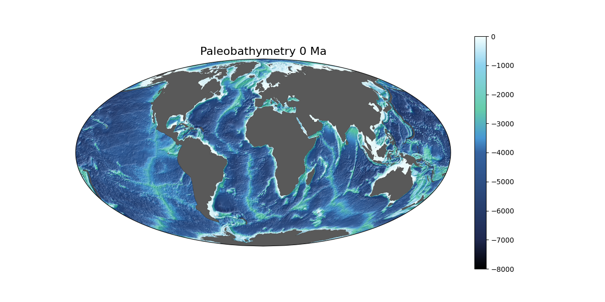
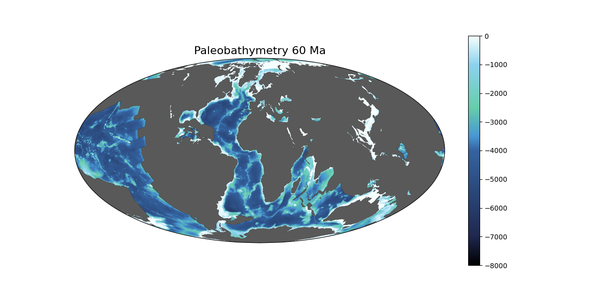
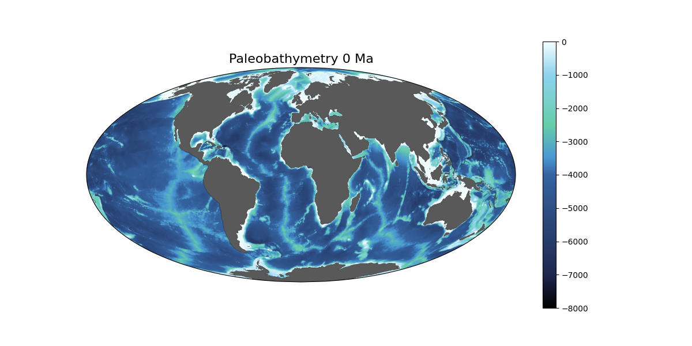
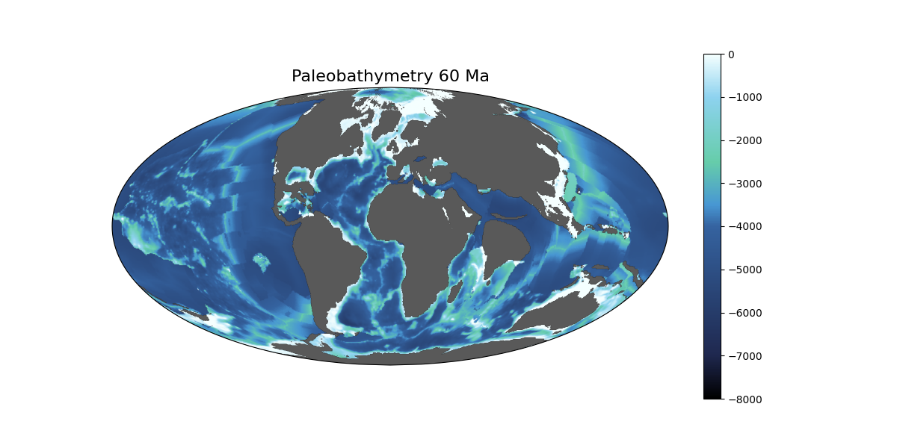

.. _pybacktrack_paleo_bathymetry:

Paleobathymetry
===============

.. contents::
   :local:
   :depth: 2

.. _pybacktrack_paleo_bathymetry_overview:

Overview
--------

The ``paleo_bathymetry`` module is used to generate paleo bathymetry grids by reconstructing and backtracking present-day sediment-covered crust through time.

PyBacktrack only generates paleobathymetry for crust that exists at present day.
However you can optionally merge this with *traditional* paleobathymetry grids produced by an external workflow that generates paleobathymetry for synthetic crust.
The traditional grids may contain paleobathymetry on subducted crust that is not covered by the reconstructed present-day sediment-deposited crust generated by pyBacktrack.

.. _pybacktrack_running_paleo_bathymetry:

Running paleobathymetry
-----------------------

You can either run ``paleo_bathymetry`` as a built-in script, specifying parameters as command-line options (``...``):

.. code-block:: python

    python -m pybacktrack.paleo_bathymetry_cli ...

...or ``import pybacktrack`` into your own script, calling its functions and specifying parameters as function arguments (``...``):

.. code-block:: python

    import pybacktrack
    
    pybacktrack.reconstruct_paleo_bathymetry_grids(...)

.. note:: You can run ``python -m pybacktrack.paleo_bathymetry_cli --help`` to see a description of all command-line options available, or
          see the :ref:`paleobathymetry reference section <pybacktrack_reference_paleobathymetry>` for documentation on the function parameters.

.. _pybacktrack_paleo_bathymetry_example:

Example
^^^^^^^

To generate paleobathymetry NetCDF grids at 12 minute resolution from 0Ma to 240Ma in 1Myr increments, we can run it from the command-line as:

.. code-block:: python

    python -m pybacktrack.paleo_bathymetry_cli \
        -gm 12 \
        -ym M7 \
        -m GDH1 \
        --use_all_cpus \
        -- \
        240 paleo_bathymetry_12m_M7_GDH1

...where the ``-gm`` option specifies the grid spacing (12 minutes),
the ``-ym`` specifies the ``M7`` :ref:`dynamic topography model <pybacktrack_dynamic_topography>`,
the ``-m`` option specifies the ``GDH1`` :ref:`oceanic subsidence model <pybacktrack_oceanic_subsidence>`,
the ``--use_all_cpus`` option uses all CPUs (it also accepts an optional number of CPUs) and
the generated paleobathymetry grid files are named ``paleo_bathymetry_12m_M7_GDH1_<time>.nc``.

...or write some Python code to do the same thing:

.. code-block:: python

    import pybacktrack
    
    pybacktrack.reconstruct_paleo_bathymetry_grids(
        'paleo_bathymetry_12m_M7_GDH1',
        0.2,  # degrees (same as 12 minutes)
        240,
        dynamic_topography_model='M7',
        ocean_age_to_depth_model=pybacktrack.AGE_TO_DEPTH_MODEL_GDH1,
        use_all_cpus=True)  # can also be an integer (the number of CPUs to use)

.. _pybacktrack_paleo_bathymetry_output:

Paleobathymetry output
----------------------

The following shows two of the 241 paleobathymetry NetCDF grids generated by the example above. The first at present day and the second at 60 Ma.

They were both generated using the `Paleobathymetry <https://github.com/EarthByte/pyBacktrack/blob/master/pybacktrack/notebooks/paleobathymetry.ipynb>`__ notebook.

.. note:: The example notebooks are installed as part of the example data which can be installed by following :ref:`these instructions <pybacktrack_install_examples>`.

.. _pybacktrack_merge_traditional_paleo_bathymetry:

Merging with traditional paleobathymetry
----------------------------------------

PyBacktrack only generates reconstructed paleobathymetry for sediment-deposited crust that exists at *present day*.

However you can merge this with *traditional* paleobathymetry grids produced by an external workflow that generates paleobathymetry for synthetic crust.
This means the traditional grids will fill in paleobathymetry in regions where crust has been subducted at present day.

.. note:: This merging can be achieved using the ``--merge_paleo_bathymetry_filename_format`` command-line option
          (or the ``merge_paleo_bathymetry_filename_format`` function argument of ``pybacktrack.reconstruct_paleo_bathymetry_grids``).

Traditional paleobathymetry grids must still be produced by an external workflow.
The `Paleobathymetry <https://github.com/EarthByte/pyBacktrack/blob/master/pybacktrack/notebooks/paleobathymetry.ipynb>`__ notebook merges traditional paleobathymetry created using Nicky Wright's paleobathymetry workflow
(currently in a `private repository <https://github.com/EarthByte/paleobathymetry-workflow>`__ that might be incorporated into `GPlately <https://github.com/GPlates/gplately/>`__ in the future).

There are traditional (and merged) paleobathymetry grids available for the default plate model in pyBacktrack (Zahirovic 2022) for both of its reference frames:

Traditional paleobathymetry for the Zahirovic 2022 plate model (for ages 0 to 410 Ma):

* In the `paleomagnetic reference frame <https://repo.gplates.org/webdav/PlateModel_Age_SR_Grids/Zahirovic_etal_2022_GDJ/02_AgegridsUsingTopologies/PaleomagneticFrame/PaleobathymetryGrids/traditional/GDH1/>`__ (anchor plate `701701`).
* In the `mantle reference frame <https://repo.gplates.org/webdav/PlateModel_Age_SR_Grids/Zahirovic_etal_2022_GDJ/02_AgegridsUsingTopologies/OptimisedMantleFrame/PaleobathymetryGrids/traditional/GDH1/>`__ (anchor plate `0`).

And merged paleobathymetry for the Zahirovic 2022 plate model for ages 0 to 170 Ma (where 170 Ma is roughly when backtracked present-day crust no longer exists back in time):

* In the `paleomagnetic reference frame <https://repo.gplates.org/webdav/PlateModel_Age_SR_Grids/Zahirovic_etal_2022_GDJ/02_AgegridsUsingTopologies/PaleomagneticFrame/PaleobathymetryGrids/pybacktrack/GDH1/>`__ (anchor plate `701701`).
* In the `mantle reference frame <https://repo.gplates.org/webdav/PlateModel_Age_SR_Grids/Zahirovic_etal_2022_GDJ/02_AgegridsUsingTopologies/OptimisedMantleFrame/PaleobathymetryGrids/pybacktrack/GDH1/>`__ (anchor plate `0`).

The following shows merged paleobathymetry in the *paleomagnetic* reference frame, at present day (0 Ma) and 60 Ma.

They were both generated using the `Paleobathymetry <https://github.com/EarthByte/pyBacktrack/blob/master/pybacktrack/notebooks/paleobathymetry.ipynb>`__ notebook.
Please see that notebook for details on how the merging was achieved.

Note the difference at 60 Ma in the merged paleobathymetry (compared to the unmerged paleobathymetry shown previously).
For example, the region west of the Americas is now filled with traditional paleobathymetry.
This region exists at 60 Ma but will be subducted at present day.

.. _pybacktrack_paleo_bathymetry_gridding_procedure:

Paleobathymetry gridding procedure
----------------------------------

Paleobathymetry gridding uses the :ref:`built-in rift start/end age grids <pybacktrack_builtin_rift_gridding_procedure>` along with the existing subsidence models (continental rifting and oceanic) and
the sediment decompaction functionality in pyBacktrack to generate paleo bathymetry grids (typically in 1 Myr intervals).

The ``paleo_bathymetry`` module has similar options to the ``backtrack`` module. Such as options for the present day grids containing age, bathymetry, crustal thickness and sediment thickness.
And options for the dynamic topography and sea level models. And the defaults for those options are the same as the ``backtrack`` module (except for the default *lithology* - see below).
For example, the ``paleo_bathymetry`` module defaults to the same :ref:`present-day ETOPO1 bathymetry grid <pybacktrack_present_day_tectonic_subsidence>`.

However the ``paleo_bathymetry`` module differs from the ``backtrack`` module in that, instead of a single point location for a drill site, a uniform grid of points containing sediment
(inside valid regions of the total sediment thickness grid) are backtracked to obtain gridded paleo water depths through time.

.. note:: Sediment grid points near trenches are excluded by default to avoid deep bathymetry areas near trenches appearing in the reconstructed grids.
          Each trench has an exclusion distance on the subducting plate side (typically 60 kms) and an exlusion distance on the overriding plate side (typically 0 kms).
          Any sediment grid points within these per-trench distances are excluded.
          These distances are all built into pyBacktrack and vary from trench to trench.
          They were hand tuned for each trench based on their resultant paleobathymetry.
          However this masking near trenches can be removed by specifying  ``--exclude_distances_to_trenches_kms 0 0``
          (for example, in the :ref:`paleo bathymetry example above <pybacktrack_paleo_bathymetry_example>`).
          To retain the masking near trenches but remove the built-in hand tuning of distances you can specify ``--exclude_distances_to_trenches_kms 60 0``.
          This will apply a global exclusion distance of 60 kms on the subducting plate side (and no exclusion on the overriding plate side).

As with regular backtracking, those sediment grid points lying inside the age grid (valid regions) use an oceanic subsidence model and those outside use a continental rifting model.
However, for the continental rifting model, in lieu of explicitly providing the rift start and end ages (as for a 1D drill site), each 2D grid point samples the built-in rift start/end age grids.

.. note:: You can optionally override the rift periods sampled from the built-in rift start/end grids with a single rift period using the ``--rifting_period`` command-line option.
          However this overrides the *spatially varying* rift periods (of built-in rift start/end grids) with a *constant* rift period.
          And hence is typically only useful for regional reconstructions (not global).

Each grid point is assigned a plate ID and reconstructed back through time (using a reconstruction model consisting of static polygons and rotations).
You can either use the default built-in reconstruction model, or specify your own static polygon and rotation files
(using the ``--static_polygon_filename`` and ``--rotation_filenames`` command-line options).

The default reconstruction model is Zahirovic 2022:

* Zahirovic, S., Eleish, A., Doss, S., Pall, J., Cannon, J., Pistone, M., Tetley, M. G., Young, A., & Fox, P. (2022),
  `Subduction kinematics and carbonate platform interactions. Geoscience Data Journal, 9(2), p.371-383, <https://doi.org/10.1002/gdj3.146>`__
  (data obtained `here <https://zenodo.org/records/13899315>`__)

The default reference frame for the Zahirovic 2022 model is the mantle reference frame (anchor plate ``0``).
Alternatively you can use its *paleomagnetic* reference frame by specifying anchor plate ``701701`` (using the command-line option ``--anchor 701701``).
This can be useful for paleoclimate-related research.

.. note:: In pyBacktrack versions ``1.4`` and older, the default reconstruction model was Müller 2019:
          
          * Müller, R. D., Zahirovic, S., Williams, S. E., Cannon, J., Seton, M., Bower, D. J., Tetley, M. G., Heine, C., Le Breton, E., Liu, S., Russell, S. H. J., Yang, T., Leonard, J., and Gurnis, M. (2019),
            `A global plate model including lithospheric deformation along major rifts and orogens since the Triassic. Tectonics, vol. 38, <https://doi.org/10.1029/2018TC005462>`__.
          
          | Whereas in pyBacktrack ``1.5`` onwards the default is Zahirovic 2022.
          | Müller 2019 is nearly identical to Zahirovic 2022 for the time period 250 Ma to present day.
            The difference is due to the Zahirovic 2022 model including deformation in South China (from `Cao et al. 2021 <https://doi.org/10.1016/j.earscirev.2021.103605>`__).
            This resulted in the optimised mantle reference frame being slightly different for this time period.
          | Another difference is the Müller 2019 model does *not* include a paleomagnetic reference frame (ie, no anchor plate ``701701``).

.. note:: | Using a *non-default* reconstruction model (static polygons and rotations), or changing the reference frame (anchor plate), only affects the reconstruction
            of the present day sediment grid points into their *final paleobathymetry grid locations*.
          | In particular, this does *not* affect :ref:`dynamic topography <pybacktrack_dynamic_topography>`.
            This is because each dynamic topography model has its own reconstruction model (and mantle reference frame) that it uses to
            independently reconstruct the present day sediment grid points into locations appropriate for sampling that dynamic topography model's mantle-reference-frame grids.

Each grid point has a single lithology, with an initial compacted thickness sampled from the total sediment thickness grid at present day that is progressively decompacted back through geological time.

.. note:: The single lithology defaults to ``Average_ocean_floor_sediment`` which is the average of the ocean floor sediment.
          This differs from the :ref:`base lithology of drill sites <pybacktrack_base_sediment_layer>` where the undrilled portions of drill sites are usually below the
          Carbonate Compensation Depth (CCD) where shale dominates. Note that you can override the default lithology by specifying the ``-b`` command-line option.

.. note:: In pyBacktrack versions ``1.4`` and older, the single lithology defaulted to ``Shale`` (not ``Average_ocean_floor_sediment``).

The decompaction progresses incrementally (eg, in 1 Myr intervals) assuming a constant (average) decompacted sedimentation rate over the entire sedimentation period calculated as the fully decompacted initial thickness
(ie, using surface porosity only) divided by the sedimentation period (from start of rifting for continental crust, and from crustal age for oceanic crust, to present day).
Loading each reconstructed point’s decompacted thicknesses onto its modelled tectonic subsidence (oceanic or continental) back through time, along with the effects of dynamic topography and sea level models, reveals its history of water depths.
Finally, the reconstructed locations of all grid points and their reconstructed bathymetries are combined, at each reconstruction time, to create a history of paleo bathymetry grids.

.. note:: You can optionally merge the paleobathymetry grids (produced by ``pybacktrack`` on present day crust) with externally-produced paleobathymetry grids (on synthetic crust).
          This will insert paleobathymetry from the external grids only at grid locations not covered by the ``pybacktrack`` grids, after adding dynamic topography (if specified) to them.
          This can be achieved using the ``--merge_paleo_bathymetry_filename_format`` command-line option.

.. _pybacktrack_builtin_rift_gridding_procedure:

Built-in rift gridding procedure
--------------------------------

PyBacktrack comes with two built-in grids containing rift start and end ages on submerged continental crust at 5 minute resolution.
This is used during paleobathymetry gridding to obtain the rift periods of gridded points on continental crust.
It is also used during regular backtracking to obtain the rift period of a drill site on continental crust (when it is not specified in the drill site file or on the command-line).

The rift grids cover all submerged continental crust, not just those areas that have undergone rifting.
Submerged continental crust is where the total sediment thickness grid contains valid values but the age grid does not (ie, submerged crust that is non oceanic).

The built-in rift grids were generated using the Zahirovic 2022 deforming plate model:

* Zahirovic, S., Eleish, A., Doss, S., Pall, J., Cannon, J., Pistone, M., Tetley, M. G., Young, A., & Fox, P. (2022),
  `Subduction kinematics and carbonate platform interactions. Geoscience Data Journal, 9(2), p.371-383, <https://doi.org/10.1002/gdj3.146>`__
  (data obtained `here <https://zenodo.org/records/13899315>`__)

.. note:: In pyBacktrack versions ``1.4`` and older, the Müller 2019 deforming model was used to generate the built-in rift grids:
          
          * Müller, R. D., Zahirovic, S., Williams, S. E., Cannon, J., Seton, M., Bower, D. J., Tetley, M. G., Heine, C., Le Breton, E., Liu, S., Russell, S. H. J., Yang, T., Leonard, J., and Gurnis, M. (2019),
            `A global plate model including lithospheric deformation along major rifts and orogens since the Triassic. Tectonics, vol. 38, <https://doi.org/10.1029/2018TC005462>`__.

.. note:: The rift grids were generated with ``pybacktrack/supplementary/generate_rift_grids.py``.
          This script can be obtained by :ref:`installing the supplementary scripts <pybacktrack_install_supplementary>`.

The following paragraph gives a brief overview of rift gridding...

First, grid points on continental crust that have undergone *extensional* deformation (rifting) during their most recent deformation period have their rift start and end ages assigned
as the start and end of that most recent deformation period (for each grid point).
Next, grid points on continental crust that have undergone *contractional* deformation during their most recent deformation period have their rift periods set to default values (currently 200 to 0 Ma)
to model these complex areas with simple rifting (despite a rifting model no longer strictly applying).
So that covers the *deforming* grid points on continental crust.
Next, the *non-deforming* grid points on continental crust obtain their rift period from the nearest deforming grid points.
This ensures that all continental crust contains a rift period and hence can be used to generate paleobathymetry grids from all present day continental crust.

.. note:: | In pyBacktrack ``1.4`` and older, only the continental grid points that were *submerged* were stored in the built-in rift grids,
            since only *submerged* crust needs backtracking.
          | However in pyBacktrack ``1.5`` onwards, the built-in rift grids have *global* coverage.
            Here each grid point that is *not on* deforming continental crust (ie, could be oceanic or non-deforming continental) inherits the rift period of the nearest grid point *on* deforming continental crust.
            In submerged continental regions, the rift periods are the same as in pyBacktrack ``1.4``, but we now also get rift periods outside *submerged continental* regions.
            This avoids tying the built-in rift grids to the *default* age grid (determines which crust is *continental*) and the *default* total sediment thickness grid (determines which crust is *submerged*).
            For example, you might specify an age grid that has a slightly different continental-oceanic boundary.
            Or you might specify a total sediment thickness that has a slightly different coastline.
            And in these cases you can now generate paleobathymetry grids that don't have gaps due to misalignments between, for example, your age grid boundary and the built-in rift grid boundaries (which are now boundaryless).

The following paragraph gives a more detailed explanation of how deformation in particular is used in ``pybacktrack/supplementary/generate_rift_grids.py``...

The script allows one to specify a total sediment thickness grid and an age grid (defaulting to those included with pyBacktrack).
Grid points are uniformly generated in longitude/latitude space on continental crust.
Next pyGPlates is used to load the Zahirovic 2022 topological plate model (containing rigid plate polygons and deforming networks) and reconstruct these continental grid points on back through geological time.
Note that plate IDs do not need to be explicitly assigned in order to be able to reconstruct because functionality in pyGPlates, known as *reconstructing by topologies*, essentially continually assigns plate IDs
using the topological plate polygons and deforming networks while each grid point is reconstructed back through time.
This ensures the path of each grid point is correctly reconstructed through deforming regions so that we can correctly determine when it enters and exits a deforming region.
During this reconstruction each grid point is queried (at 1Myr intervals) whether it passes through a deforming network.
The time at which a reconstructed grid point first encounters a deforming network (going backward in time) becomes its potential rift end time.
Following that point further back in time we find when it first exits a deforming network (again going backward in time), which becomes its potential rift start time.
We also keep track of a crustal stretching factor through time for each grid point so we can distinguish between extensional and contractional deformation.
