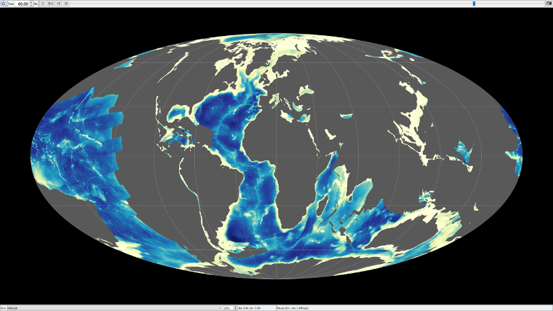

.. _pybacktrack_paleo_bathymetry:

Paleobathymetry
===============

.. contents::
   :local:
   :depth: 2

.. _pybacktrack_paleo_bathymetry_overview:

Overview
--------

The ``paleo_bathymetry`` module is used to generate paleo bathymetry grids by reconstructing and backtracking present-day sediment-covered crust through time.

.. _pybacktrack_running_paleo_bathymetry:

Running paleobathymetry
-----------------------

You can either run ``paleo_bathymetry`` as a built-in script, specifying parameters as command-line options (``...``):

.. code-block:: python

    python -m pybacktrack.paleo_bathymetry_cli ...

...or ``import pybacktrack`` into your own script, calling its functions and specifying parameters as function arguments (``...``):

.. code-block:: python

    import pybacktrack
    
    pybacktrack.reconstruct_paleo_bathymetry_grids(...)

.. note:: You can run ``python -m pybacktrack.paleo_bathymetry_cli --help`` to see a description of all command-line options available, or
          see the :ref:`paleobathymetry reference section <pybacktrack_reference_paleobathymetry>` for documentation on the function parameters.

.. _pybacktrack_paleo_bathymetry_example:

Example
^^^^^^^

To generate paleobathymetry NetCDF grids at 12 minute resolution from 0Ma to 240Ma in 1Myr increments, we can run it from the command-line as:

.. code-block:: python

    python -m pybacktrack.paleo_bathymetry_cli \
        -gm 12 \
        -ym M7 \
        -m GDH1 \
        --use_all_cpus \
        -- \
        240 paleo_bathymetry_12m_M7_GDH1

...where the ``-gm`` option specifies the grid spacing (12 minutes),
the ``-ym`` specifies the ``M7`` :ref:`dynamic topography model <pybacktrack_dynamic_topography>`,
the ``-m`` option specifies the ``GDH1`` :ref:`oceanic subsidence model <pybacktrack_oceanic_subsidence>`,
the ``--use_all_cpus`` option uses all CPUs (it also accepts an optional number of CPUs) and
the generated paleobathymetry grid files are named ``paleo_bathymetry_12m_M7_GDH1_<time>.nc``.

...or write some Python code to do the same thing:

.. code-block:: python

    import pybacktrack
    
    pybacktrack.reconstruct_paleo_bathymetry_grids(
        'paleo_bathymetry_12m_M7_GDH1',
        0.2,  # degrees (same as 12 minutes)
        240,
        dynamic_topography_model='M7',
        ocean_age_to_depth_model=pybacktrack.AGE_TO_DEPTH_MODEL_GDH1,
        use_all_cpus=True)  # can also be an integer (the number of CPUs to use)

.. _pybacktrack_paleo_bathymetry_output:

Paleobathymetry output
----------------------

The following shows two of the 241 paleobathymetry NetCDF grids generated by the example above. They're both visualised in GPlates, the first at present day and the second at 60 Ma.

Also the `Paleobathymetry <https://github.com/EarthByte/pyBacktrack/blob/master/pybacktrack/notebooks/paleobathymetry.ipynb>`_ notebook has a similar example.

.. note:: The example notebooks are installed as part of the example data which can be installed by following :ref:`these instructions <pybacktrack_install_examples>`.

.. _pybacktrack_paleo_bathymetry_gridding_procedure:

Paleobathymetry gridding procedure
----------------------------------

Paleobathymetry gridding uses the :ref:`builtin rift start/end age grids <pybacktrack_builtin_rift_gridding_procedure>` along with the existing subsidence models (continental rifting and oceanic) and
the sediment decompaction functionality in pyBacktrack to generate paleo bathymetry grids (typically in 1 Myr intervals).

The ``paleo_bathymetry`` module has similar options to the ``backtrack`` module such as options for present-day age/topography/crustal-thickness/sediment-thickness grids, dynamic-topography/sea-level models, etc.
Except that, instead of a single point location for a well site, a uniform grid of points containing sediment (inside valid regions of the total sediment thickness grid) are backtracked to obtain gridded paleo water depths through time.

.. note:: Sediment grid points near trenches are excluded by default to avoid deep bathymetry areas near trenches appearing in the reconstructed grids.
          Each trench has an exclusion distance on the subducting plate side (typically 60 kms) and an exlusion distance on the overriding plate side (typically 0 kms).
          And these per-trench distances are all built into pyBacktrack. Any sediment grid points within these per-trench distances are excluded.
          However this masking near trenches can be removed by specifying  ``--exclude_distances_to_trenches_kms 0 0``
          (for example, in the :ref:`paleo bathymetry example above <pybacktrack_paleo_bathymetry_example>`).

As with regular backtracking, those sediment grid points lying inside the age grid (valid regions) use an oceanic subsidence model and those outside use a continental rifting model.
However, in lieu of explicitly providing the rift start and end ages (as for a 1D well site) each 2D grid point samples the builtin rift start/end age grids.
Each grid point is also assigned a plate ID (using static polygons) and reconstructed back through time.

Each grid point has a single lithology, with an initial compacted thickness sampled from the total sediment thickness grid at present day that is progressively decompacted back through geological time.

.. note:: The single lithology defaults to ``Shale``. This is the same as the default :ref:`base sediment layer <pybacktrack_base_sediment_layer>` used in drill sites
          where the undrilled portions of drill sites are usually below the Carbonate Compensation Depth (CCD) where shale dominates.
          However a more appropriate lithology for paleobathymetry is ``Average_ocean_floor_sediment`` (see the available :ref:`bundled lithologies <pybacktrack_bundled_lithology_definitions>`).
          It can be used (instead of the default ``Shale``) by specifying the ``-b`` command-line option
          (eg, adding ``-b Average_ocean_floor_sediment`` to the command-line in the :ref:`above example <pybacktrack_paleo_bathymetry_example>`).
          Also note that this documentation refers to the latest **public** release. The default lithology in the latest **development** version (:ref:`installable via Github <pybacktrack_install_pybacktrack>`)
          is ``Average_ocean_floor_sediment`` (see the `documentation for the latest development version <https://pybacktrack.readthedocs.io/en/latest/pybacktrack_paleo_bathymetry.html#paleobathymetry-gridding-procedure>`_).
          This will also be the default in the next public release.

The decompaction progresses incrementally (eg, in 1 Myr intervals) assuming a constant (average) decompacted sedimentation rate over the entire sedimentation period calculated as the fully decompacted initial thickness
(ie, using surface porosity only) divided by the sedimentation period (from start of rifting for continental crust, and from crustal age for oceanic crust, to present day).
Loading each reconstructed point’s decompacted thicknesses onto its modelled tectonic subsidence (oceanic or continental) back through time, along with the effects of dynamic topography and sea level models, reveals its history of water depths.
Finally, the reconstructed locations of all grid points and their reconstructed bathymetries are combined, at each reconstruction time, to create a history of paleo bathymetry grids.

.. note:: The supplementary script ``pybacktrack/supplementary/merge_paleo_bathymetry_grids.py`` can preferentially merge paleobathymetry grids produced by ``pybacktrack`` with externally produced paleobathymetry grids.
          This script first adds a user-specified dynamic topography to the external grids and then inserts only at grid locations not covered by the ``pybacktrack`` grids
          (eg, the external grids may contain paleobathymetry on subducted crust that is not covered by the reconstructed present-day sediment-deposited crust generated by ``pybacktrack``).
          This script can be obtained by :ref:`installing the supplementary scripts <pybacktrack_install_supplementary>`.

.. _pybacktrack_builtin_rift_gridding_procedure:

Builtin rift gridding procedure
-------------------------------

PyBacktrack comes with two builtin grids containing rift start and end ages on submerged continental crust at 5 minute resolution.
This is used during paleobathymetry gridding to obtain the rift periods of gridded points on continental crust.
It is also used during regular backtracking to obtain the rift period of a drill site on continental crust (when it is not specified in the drill site file or on the command-line).

The rift grids cover all submerged continental crust, not just those areas that have undergone rifting.
Submerged continental crust is where the total sediment thickness grid contains valid values but the age grid does not (ie, submerged crust that is non oceanic).

The rift grids were generated with ``pybacktrack/supplementary/generate_rift_grids.py`` using the Müller 2019 deforming plate model:

* Müller, R. D., Zahirovic, S., Williams, S. E., Cannon, J., Seton, M., Bower, D. J., Tetley, M. G., Heine, C., Le Breton, E., Liu, S., Russell, S. H. J., Yang, T., Leonard, J., and Gurnis, M. (2019),
  `A global plate model including lithospheric deformation along major rifts and orogens since the Triassic. Tectonics, vol. 38, <https://doi.org/10.1029/2018TC005462>`_.

.. note:: The rift generation script ``pybacktrack/supplementary/generate_rift_grids.py`` can be obtained by :ref:`installing the supplementary scripts <pybacktrack_install_supplementary>`.

This paragraph gives a brief overview of rift gridding...
First, grid points on continental crust that have undergone *extensional* deformation (rifting) during their most recent deformation period have their rift start and end ages assigned
as the start and end of that most recent deformation period (for each grid point).
Next, grid points on continental crust that have undergone *contractional* deformation during their most recent deformation period have their rift periods set to default values (currently 200 to 0 Ma)
to model these complex areas with simple rifting (despite a rifting model no longer strictly applying).
So that covers the *deforming* grid points on continental crust.
Next, the *non-deforming* grid points on continental crust obtain their rift period from the nearest deforming grid points.
This ensures that all continental crust contains a rift period and hence can be used to generate paleobathymetry grids from all present day continental crust.
Finally, only those continental grid points that are submerged are stored in the final rift grids since we only need to backtrack submerged crust.

This paragraph gives a more detailed explanation of how deformation in particular is used in ``pybacktrack/supplementary/generate_rift_grids.py``...
The script allows one to specify a total sediment thickness grid and an age grid (defaulting to those included with pyBacktrack).
Grid points are uniformly generated in longitude/latitude space on continental crust.
Next pyGPlates is used to load the Müller 2019 topological plate model (containing rigid plate polygons and deforming networks) and reconstruct these continental grid points on back through geological time.
Note that plate IDs do not need to be explicitly assigned in order to be able to reconstruct because recent functionality in pyGPlates, known as *reconstructing by topologies*, essentially continually assigns plate IDs
using the topological plate polygons and deforming networks while each grid point is reconstructed back through time.
This ensures the path of each grid point is correctly reconstructed through deforming regions so that we can correctly determine when it enters and exits a deforming region.
During this reconstruction each grid point is queried (at 1Myr intervals) whether it passes through a deforming network.
The time at which a reconstructed grid point first encounters a deforming network (going backward in time) becomes its potential rift end time.
Following that point further back in time we find when it first exits a deforming network (again going backward in time), which becomes its potential rift start time.
We also keep track of a crustal stretching factor through time for each grid point so we can distinguish between extensional and contractional deformation.
